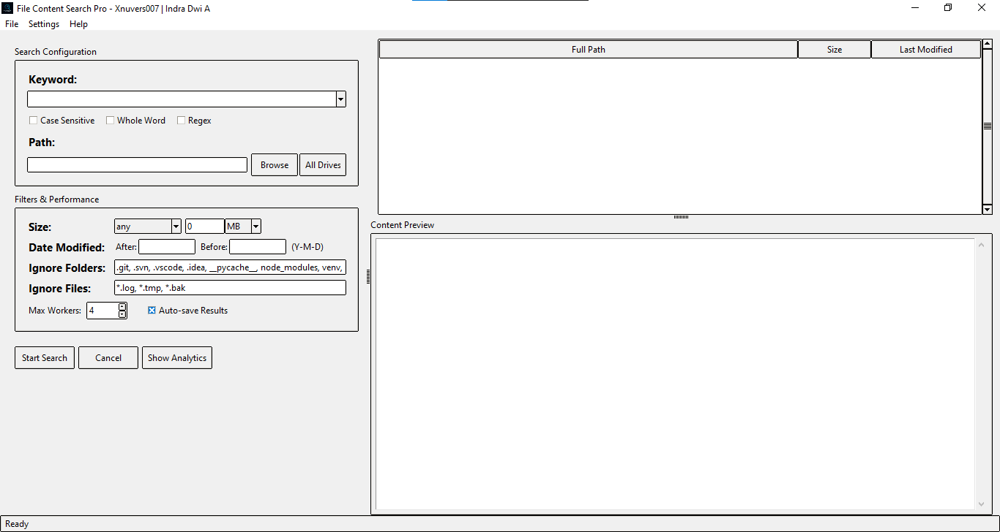
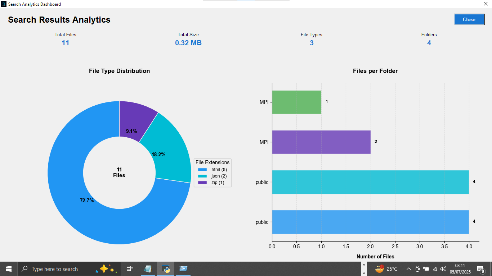
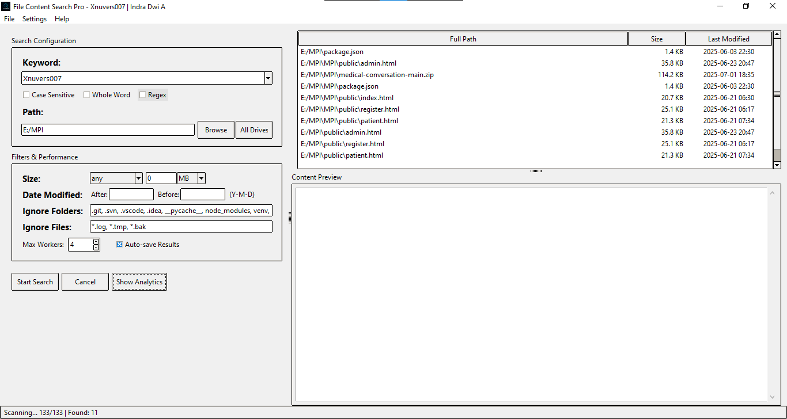
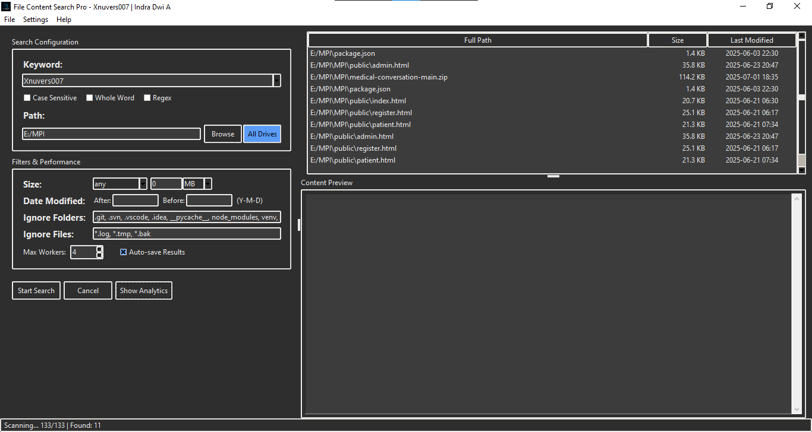
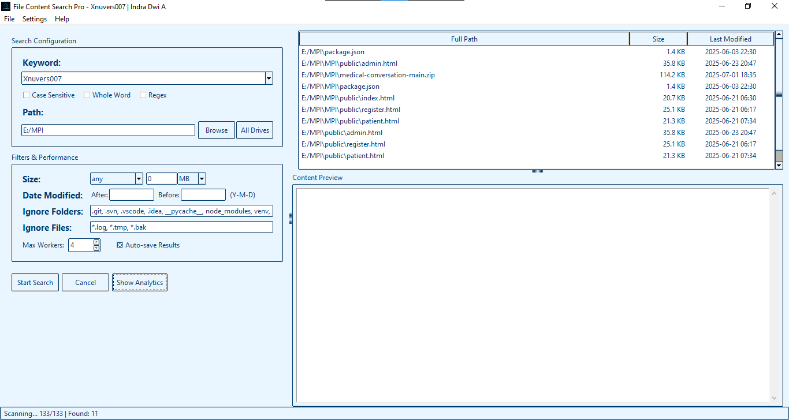
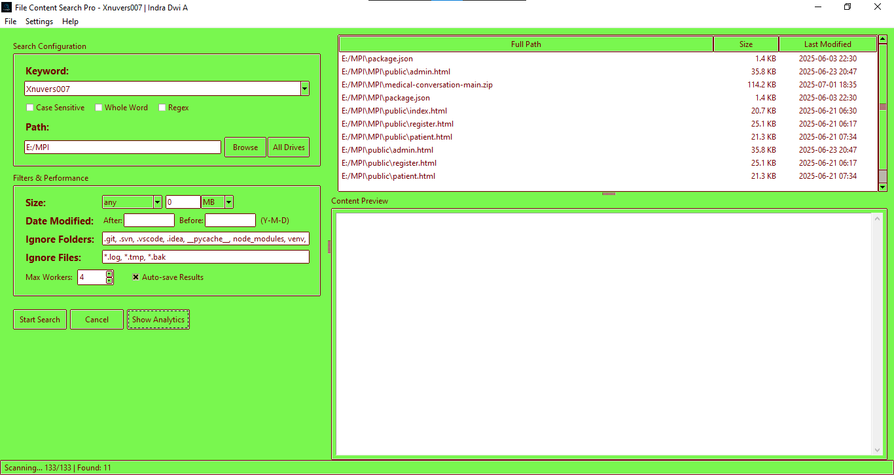

<div align="center">
  
  <h1>File Content Search Pro</h1>
  <p><strong>🔍 Solusi Pencarian Konten File Terkemuka dengan Analitik Terintegrasi</strong></p>

  <p>
    <a href="#fitur">Fitur</a> • 
    <a href="#dashboard-analitik-terintegrasi">Analytics</a> • 
    <a href="#panduan-penggunaan">Getting Started</a> • 
    <a href="#instalasi">Installation</a> • 
    <a href="#🎭-opsi-tema">Customization</a> • 
    <a href="#💻-teknologi-unggulan">Technical</a> • 
    <a href="#📝-kontribusi">Contribution</a> • 
    <a href="#👤-author">Author</a>
  </p>

  <p>
    
    
    
    
  </p>
</div>

---

## 🌟 Ringkasan

**File Content Search Pro** adalah aplikasi desktop canggih yang dirancang untuk profesional dan pengguna yang membutuhkan kemampuan pencarian konten file yang komprehensif. Dibangun dengan Python dan Tkinter, aplikasi ini menggabungkan kecepatan pencarian yang luar biasa dengan analitik data yang mendalam, memungkinkan Anda menemukan, menganalisis, dan memvisualisasikan informasi penting dari berbagai jenis file dengan cepat dan efisien.

---

## ✨ Fitur

<div align="center">
  
</div>

### 📄 Dukungan Format File Lengkap

- **Dokumen**: PDF, DOCX, TXT, RTF, ODT  
- **Arsip**: ZIP, RAR, 7Z  
- **Kode**: PY, JS, HTML, CSS, JAVA, PHP  
- **Data**: CSV, JSON, XML, YAML
- dll. / etc.

### 🔎 Kemampuan Pencarian Lanjutan

- Pencarian regex
- Pencocokan huruf besar/kecil
- Pencocokan kata utuh
- Filter berdasarkan ukuran, tanggal modifikasi, dan ekstensi

### ⚡ Arsitektur Berperforma Tinggi

- Multi-threading: memanfaatkan semua core CPU
- Optimasi memori: efisien untuk file besar
- Hasil inkremental: tampilkan hasil secepat ditemukan

### 👁️ Preview & Interaksi

- Highlight hasil pencarian di dalam file
- Buka file langsung dari hasil pencarian

---

## 📈 Dashboard Analitik Terintegrasi

<div align="center">
  
</div>

Dashboard analitik memberikan insight tambahan dari hasil pencarian Anda:

- **Distribusi File**: Diagram doughnut berdasarkan jenis file
- **Analisis Lokasi**: Folder dengan hasil terbanyak
- **Kepadatan Konten**: File dengan jumlah hasil tertinggi
- **Metode Waktu**: Statistik berdasarkan tanggal dibuat/diedit

---

## 🚀 Panduan Penggunaan

1. Masukkan kata kunci atau pola regex
2. Pilih lokasi folder atau drive
3. Atur filter lanjutan jika perlu
4. Tekan "Search" dan amati hasil real-time
5. Gunakan dashboard untuk analisa visual
6. Ekspor hasil ke CSV atau PDF

---

https://github.com/user-attachments/assets/82feb08a-e10e-4abf-85b7-adc54fc596d1


## 📥 Instalasi

### Prasyarat

- OS: Windows 10/11, macOS 10.14+, atau Linux
- Python 3.7 atau lebih baru
- RAM 4GB minimum (8GB disarankan)

### Langkah Instalasi

```bash
# Clone repositori
git clone https://github.com/Xnuvers007/file-search.git

# Masuk ke folder proyek
cd file-search

# Instal dependensi
pip install -r requirements.txt

# Jalankan aplikasi
python main.py
````

---

## 🎭 Opsi Tema

<div align="center">
  <table>
    <tr>
      <td align="center"><br>Light</td>
      <td align="center"><br>Dark</td>
      <td align="center"><br>Ocean Blue</td>
      <td align="center"><br>Custom</td>
    </tr>
  </table>
</div>

Sesuaikan tampilan dengan tema bawaan atau buat tema sendiri dengan mengatur warna, font, dan elemen UI.

---

## 💻 Teknologi Unggulan

* **GUI Framework**: Python + Tkinter
* **Search Engine**: Multithreaded custom engine
* **File Parsing**: PyMuPDF, python-docx, parser custom
* **Visualisasi Data**: Matplotlib + Pandas
* **Arsitektur**: Modular dan extensible

---

## 📝 Kontribusi

Kami menyambut kontribusi dari komunitas! Untuk berkontribusi:

1. Fork repositori ini
2. Buat branch baru: `git checkout -b feature/NamaFitur`
3. Commit dan push perubahan Anda
4. Buat pull request ke branch `main`

---

## 💖 Dukungan

Jika Anda menyukai proyek ini, Anda dapat mendukung pengembang:

* ⭐ [GitHub Sponsors](https://github.com/sponsors/Xnuvers007)
* ☕ [Trakteer](https://trakteer.id/xnuvers007)
* 💎 [Saweria](https://saweria.co/xnuvers007)

---

## 📜 License

This project is licensed under the MIT License – see the [LICENSE](LICENSE) file for details.

---

## 👤 Author

<div align="left">
  
</div>

**Xnuvers007 | Indra Dwi A**

Software engineer yang fokus pada algoritma pencarian dan visualisasi data. Menciptakan File Content Search Pro untuk menyederhanakan pencarian informasi dari dokumen digital secara cepat dan efektif.

* 🔗 [GitHub](https://github.com/Xnuvers007)
* 🌐 [Website](https://mykingbee.blogspot.com/)

---

<p align="center"><i>Search smarter. Find faster. Understand deeper.</i></p>
